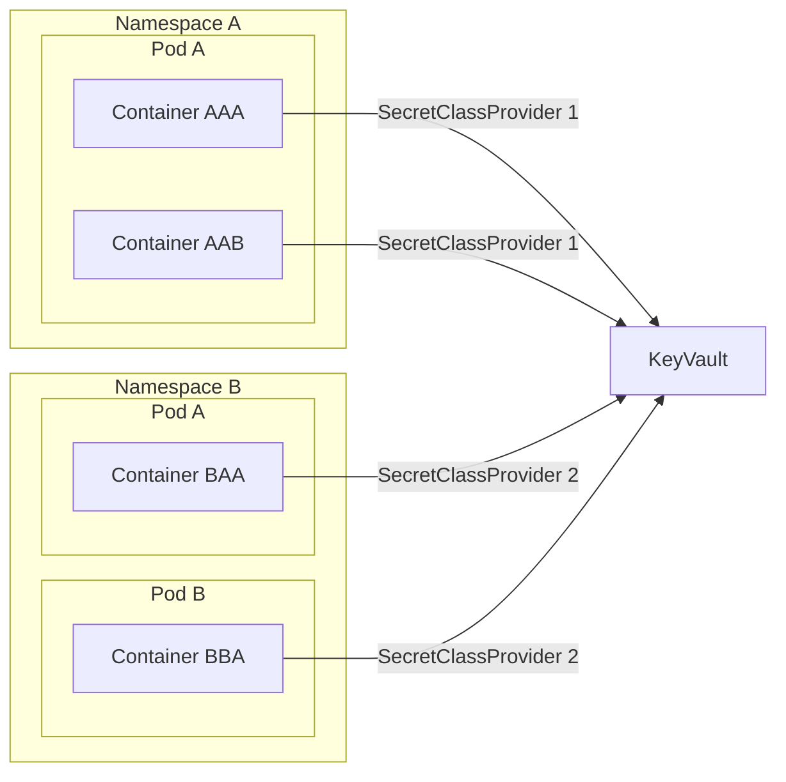
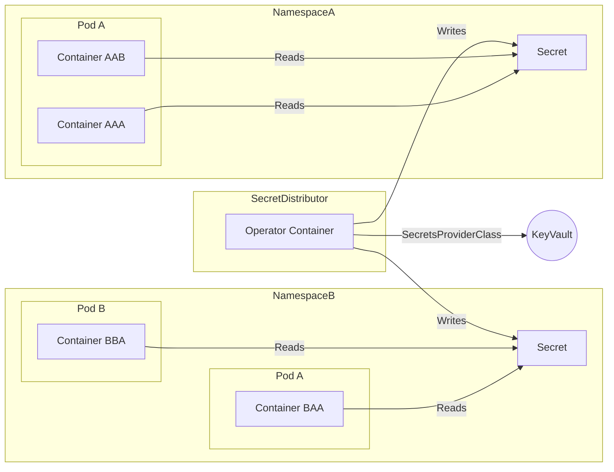

The secrets distributor effectively copies secrets that are exposed to it to destination secrets on the same or other namespaces as defined in a custom resource. This way you can get the secrets from a third party location such as key vault and have the same secrets exposed to multiple other projects without having to hook up each container to azure keyvault etc. This greatly simplifies implementation of secrets when supporting multiple providers.

The secrets distributor implements the operator model via [KOPF](https://lsc-sde.github.io/lsc-sde/Developer-Guide/KOPF.html) and each time a SecretsDistribution resource is created or amended it triggers the solution to read the secrets targeted from the /mnt/secrets folder. A new secret is then generated according to the specification in the SecretsDistribution Resource. The applications can then refer to the internal secrets from kubernetes Secret resources rather than having to have every pod refer to the azure key vault, AWS Secrets, or whatever other secret management that they may be using.

## The problem
As an example, let's say that we have an test application which requires a TLS certificate to function correctly.

We will assume for the purposes of this solution that the TLS certificate is a wildcard certificate that is going to be used in multiple applications.

The first application we're going to call test-application-1 will use this certificate. This certificate is stored in Azure Keyvault in two secrets:

* **WildcardCertificate** - The certificate itself
* **WildcardCertificateKey** - The private key of the certificate

Traditionally, we would need to create a SecretProviderClass object on the namespace:

```yaml
apiVersion: secrets-store.csi.x-k8s.io/v1
kind: SecretProviderClass
metadata:
  name: keyvault-sync
  namespace: test-application-1
  annotations:
    xlscsde.nhs.uk/secretUsage: "Key Vault Sync"
spec:
  provider: azure
  parameters:
    usePodIdentity: "false"
    useVMManagedIdentity: "true"
    userAssignedIdentityID: 9bc116bb-2090-4602-9ff6-c1adcb1f7e32
    keyvaultName: some-vault
    tenantId: 9bc116bb-2090-4602-9ff6-c1adcb1f7e32 
    objects: |
        array:
        - |
          objectName: WildcardCertificate
          objectType: secret
        - |
          objectName: WildcardCertificateKey
          objectType: secret
```

We would then need to mount this into the definition of any container that was using it:

```yaml
    ...
    volumeMounts:
    - name: secrets-store-inline
      mountPath: /mnt/secrets
      readOnly: true
    ...
volumes:
  - name: secrets-store-inline
    csi:
      driver: secrets-store.csi.k8s.io
      readOnly: true
      volumeAttributes:
        secretProviderClass: "keyvault-sync"
```

This then means that we would have to implement the SecretProviderClass object in multiple different applications separately. This becomes problematic when we are working with a variety of different infrastructure and landscapes, where some might use Azure Keyvault, others may use AWS Secret store, others may just simply mount a local folder.



The more of these that you have to maintain, the more difficult it becomes to manage and the solution. Then inside of our flux repositories we have to tell flux how to deal with all of these different eventualities and as flux does not handle control flow, it actually becomes very difficult to manage indeed.

## The solution
The secrets distributor keeps things simple on the application side by making everything use secrets inside of kubernetes, these secrets are then managed by the distributor which can then in turn be hooked up to the relevant secret store. 



This makes for only one place that needs to be managed annd the secrets distribution then just configures how those secrets are distributed around the solution:

```yaml
apiVersion: xlscsde.nhs.uk/v1
kind: SecretsDistribution
metadata:
  name: wildcard-tls-distribution
  namespace: test-application-1
  annotations:
    xlscsde.nhs.uk/secretUsage: "Wildcard Certificate"
spec:
  name: wildcard-tls-secret
  type: kubernetes.io/tls
  secrets:
  - from: WildcardCertificate
    to: tls.crt
  - from: WildcardCertificateKey
    to: tls.key
```

In the above example a new secret will be created called **wildcard-tls-secret** this secret will have a type of **kubernetes.io/tls** and will define two entries in the secret **tls.crt** and **tls.key** these will be created from the values exposed in keyvault from the entries for **WildcardCertificate** and **WildcardCertificateKey** respectively.


```yaml
    ...
    volumeMounts:
    - name: secrets-store-inline
      mountPath: /mnt/secrets
      readOnly: true
    ...
volumes:
  - name: secrets-store-inline
    secret:
        secretName: wildcard-tls-secret
```

This also gives us the option of exposing them as environmental variables instead of as a volume mount allowing us to account for a variety of other scenarios.